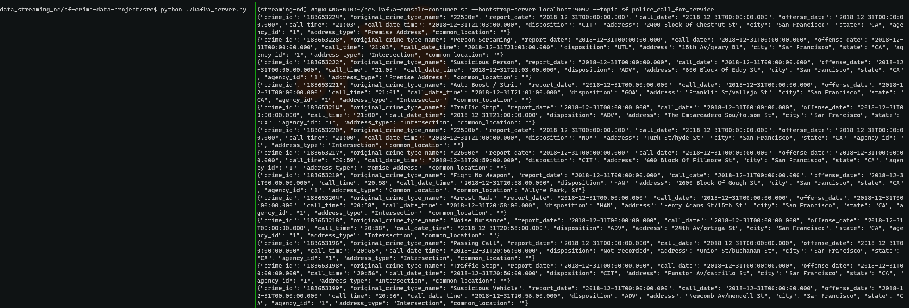
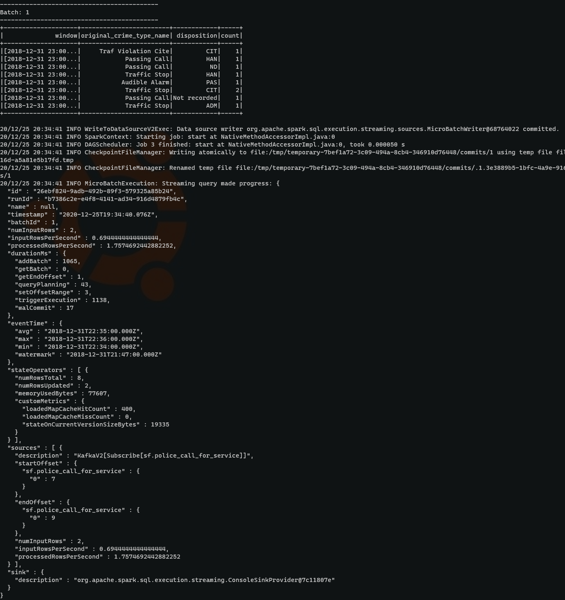
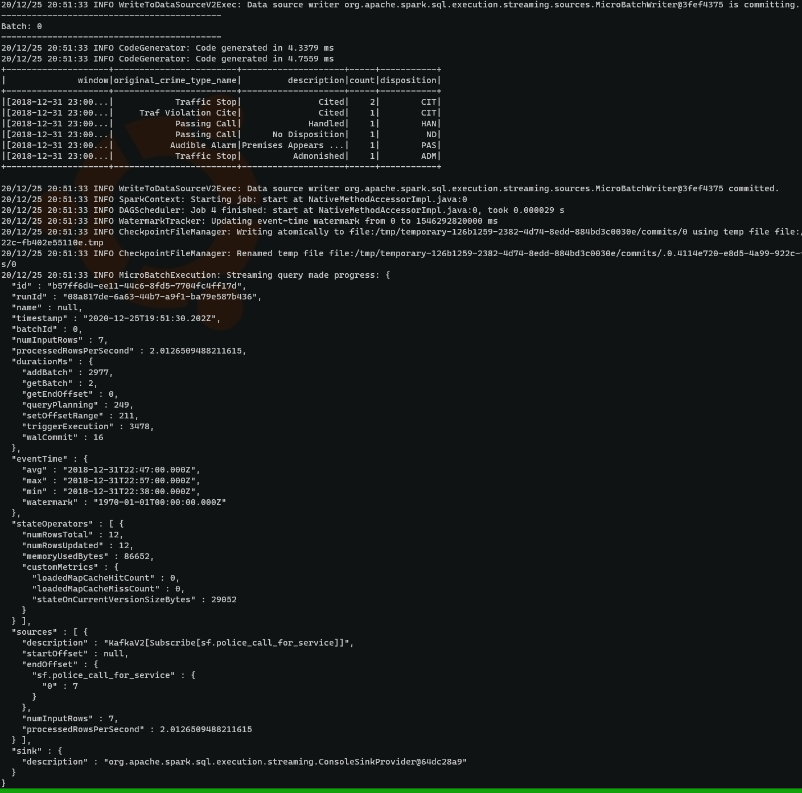

# San Francisco crime incidents analysis

Statistical analyses of a real-world dataset, extracted from Kaggle, on San Francisco crime incidents using Apache Spark Structured Streaming.

## Requirements dev-env:

this env (trial):
* Spark 2.4.3
* Scala 2.13.x
* Java 8 (openjdk)
* Kafka build with Scala 2.13.x
* Python 3.7.x

## Env paths
export SPARK_HOME=$SPARK_ROOT/spark-2.4.3-bin-hadoop2.7
export SCALA_HOME=
export JAVA_HOME=/Library/Java/JavaVirtualMachines/jdk1.8.0_181.jdk/Contents/Home
export PATH=$JAVA_HOME/bin:$SPARK_HOME/bin:$SCALA_HOME/bin:$PATH

# Spin-up zookeeper and kafka

as the kafka/bin is part of the $PATH
zookeeper-server-start.sh config/zookeeper.properties
kafka-server-start.sh config/server.properties

# Start kafka producer
python ./kafka_server.py
check produced data:

kafka-console-consumer.sh --bootstrap-server localhost:9092 --topic sf.police_call_for_service

# Submit the spark streaming app.

spark-submit --packages org.apache.spark:spark-sql-kafka-0-10_2.11:2.4.3 --master local[*] data_stream.py

Query 1:

Query 2:

# Answers

How did changing values on the SparkSession property parameters affect the throughput and latency of the data?

What were the 2-3 most efficient SparkSession property key/value pairs? Through testing multiple variations on values, how can you tell these were the most optimal?

Some important parameters to calibrate are :
1 - `maxOffsetsPerTrigger`: is an imoprtant parameter to catch-up setting it enough high when "startingOffsets" is set to "earliest". For while starting from the beginning and having enough data when set to 200  `{"numInputRows" : 200,  "processedRowsPerSecond" : 59.54153021732659}` when set to  500:  `{"numInputRows" : 500, "processedRowsPerSecond" : 139.15947676036737}`
2 - `fetchOffset.numRetries` combined with (3)
3 - `fetchOffset.retryIntervalMs`

On the writestream (and **most importantly**)
* setting the processing time is also important factor for example given that `.trigger(processingTime='10 seconds')`

The optimal solution depends on the input throughput, output throughput, and up to which time granularity we want our query result to be up to date. Given that we set-up the input frequency to 1 message/second, the in-sync config is to trigger our query each 1 second. Nevertheless, it makes sense to wait for a bit longer time as we will be aggregating more data points at once: when the trigger is set to 10 seconds to aggregate the new data -> `{"inputRowsPerSecond": 1.0, "processedRowsPerSecond": 5.685048322910745}`. When set to 5 seconds  -> `{"inputRowsPerSecond" : 1.0,  "processedRowsPerSecond" : 4.159733777038269}` which makes a trigger around 5 seconds a optimal (best compromise) choice for 1 message/s as input throughput.

The autoBroadcastJoinThreshold also makes sense here. Nevertheless, the size of `data/radio_cod.json` is small enough to be covered by the default autoBroadcastJoinThreshold of 10M.
